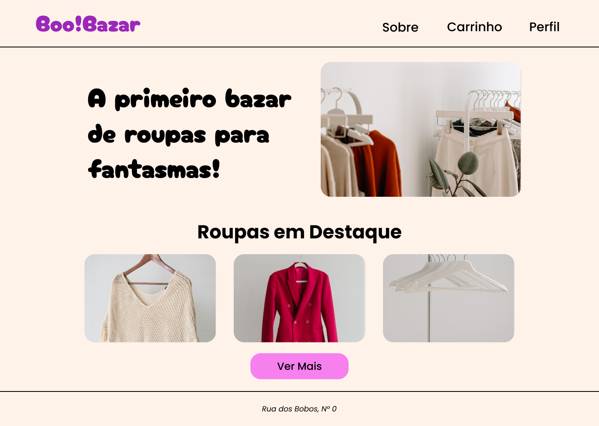
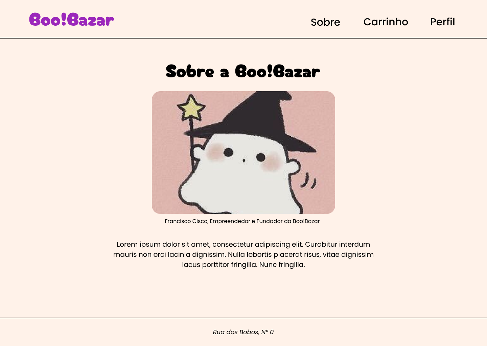

# Atividade 02 - Criação de Interface

Para essa atividade foi criado uma interface com três páginas no Figma com tema livre. Escolhi um **Bazar para Fantasmas**.

As páginas devem ter:
- Cabeçalho
- Menu
- Conteudo com texto e imagens
- Rodapé

Depois, foi criado em HTML CSS as três páginas da interface.

## Interface em HTML CSS

A interface com as três páginas pode ser conferido online no [**github.io!**](https://dvanael.github.io/webdesign-atividades/atividade-02/index.html)

## Interface no Figma

**Página Inicial**

---

**Página de Produto**

---

**Página Sobre**

---

